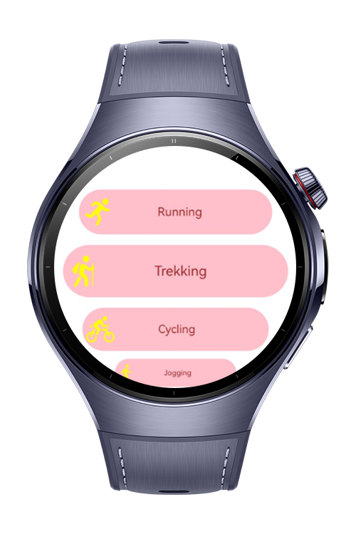
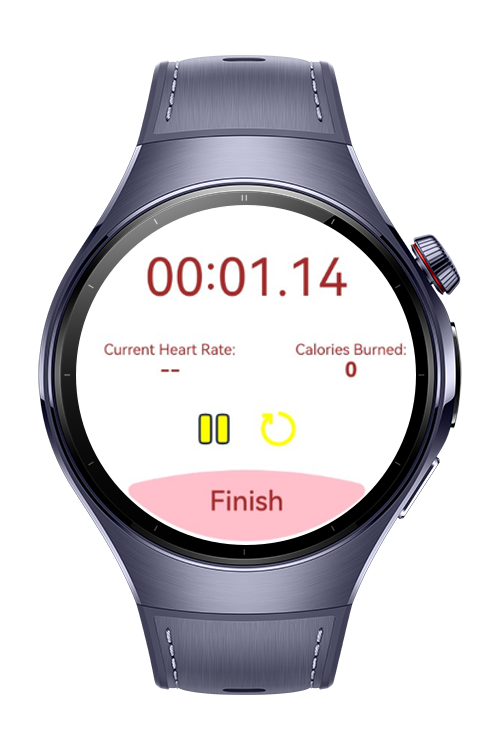

> **Note:** To access all shared projects, get information about environment setup, and view other guides, please visit [Explore-In-HMOS-Wearable Index](https://github.com/Explore-In-HMOS-Wearable/hmos-index).

# Hiking App

This mobile application provides users with an interactive way to track and manage their physical activities. From the main screen, users can select an activity and instantly view their current route on a map. The app allows users to switch to different routes as needed, offering flexibility during their exercise sessions. By tapping the More Info button, users can access detailed insights such as heart rate and exercise duration. With its responsive design and intuitive interface, the app helps users monitor their performance and stay engaged throughout their fitness journey.

# Preview

<div>


</div>

# Use Cases

1. Users can select an activity from the main screen.

2. Users can view their current route on a map.

3. Users can change to a different route if desired.

4. Users can tap the More Info button to view exercise details.

5. Users can track metrics such as heart rate and exercise duration.

# Tech Stack

- **Languages**: ArkTS
- **Frameworks**: HarmonyOS SDK 5.0.2(14)
- **Tools**: DevEco Studio Vers 5.1.0.842
- **Libraries**: @kit.MapKit, @kit.ArkUI, @kit.LocationKit, @kit.AbilityKit

# Directory Structure
   ```
   entry/src/main/ets/   
    ├── components
    │ ├── CalorieTracker.ets                   // Total calories burned UI design
    │ ├── HeartRateComponent.ets               // UI for heart rate
    ├── pages
    │ ├── Index.ets                            // Home Page
    │ ├── Location.ets                         // Map Page
    │ ├── TrackProgress.ets                    // UI components such as heart rate, burned calories etc.
    ├── services
    │ ├── LocationService.ets                  // Location Service   
    ├── viewmodel
    │ ├── ActivityModel.ets                    // Model
    │ ├── ActivityViewModel.ets                // ActivityViewModel
   ```

# Constraints and Restrictions
## Suported Devices
- Huawei Watch 5

# License
**HikingApp** is distributed under the terms of the MIT License
See the [LICENSE](./LICENSE) for more information.